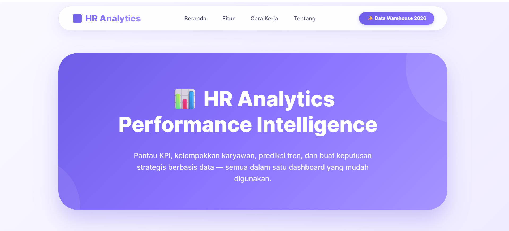
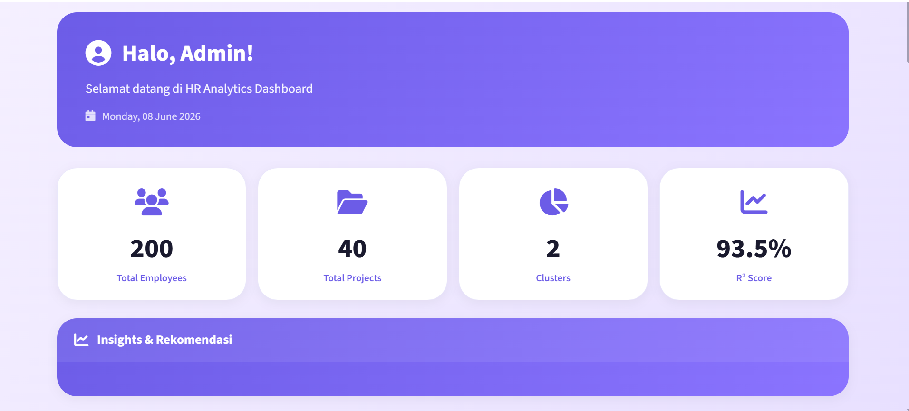
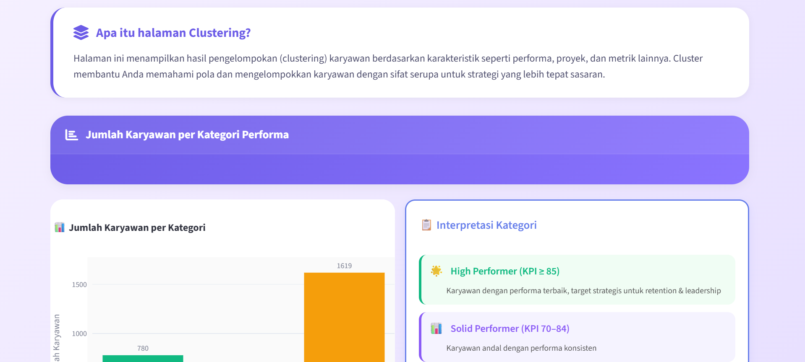
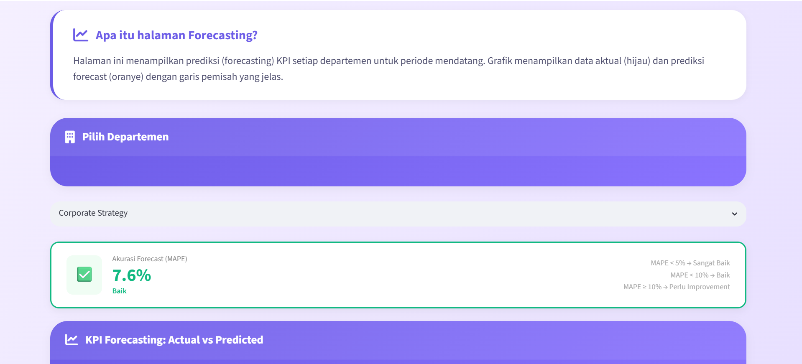

# HR Analytics Data Warehouse


[](https://hr-datamart.streamlit.app)

## Overview

HR Analytics Data Warehouse merupakan proyek integrasi data dan analitik yang menggabungkan data karyawan, departemen, proyek, dan KPI ke dalam sebuah data warehouse berbasis PostgreSQL.

Proyek ini menerapkan tiga pendekatan analitik:

* **Clustering** untuk segmentasi performa karyawan
* **Forecasting** untuk prediksi KPI departemen
* **Regression** untuk identifikasi faktor yang memengaruhi performa

---

## Dashboard Preview

### Landing Page


### Dashboard Home


### Clustering Analysis


### Forecasting Analysis


> *Screenshot diambil dari Streamlit dashboard yang berjalan di localhost.*

---

## Objectives

* Membangun data warehouse dari sumber data MySQL ke PostgreSQL.
* Menyediakan data mart untuk kebutuhan analitik HR.
* Mengelompokkan karyawan berdasarkan karakteristik dan performa.
* Memprediksi KPI departemen pada periode berikutnya.
* Mengidentifikasi faktor yang berpengaruh terhadap pencapaian KPI.
* Menyajikan hasil analisis melalui dashboard interaktif.

---

## Project Architecture

```text
datawarehouse/
│
├── data/
│   ├── clustering/
│   ├── forecasting/
│   ├── regression/
│   ├── dimensions/
│   └── outputs/
│       ├── eda/
│       ├── clustering/
│       ├── forecasting/
│       └── regression/
│
├── models/
│   ├── scaler_*.pkl
│   ├── label_encoder_*.pkl
│   ├── prophet_model_*.pkl
│   └── lgb_regressor.pkl
│
├── scripts/
│   ├── generate_data.py
│   ├── datamart.py
│   └── dashboard.py
│
├── notebooks/
├── requirements.txt
└── README.md
```

---

## Data Source

| Table            |   Rows |
| ---------------- | -----: |
| employee         |    200 |
| department       |     15 |
| position         |     20 |
| project          |     40 |
| kpi              |     15 |
| project_kpi_fact | 49,245 |

---

## ETL Process

### Extract

Mengambil data dari database MySQL `hr_project_db`.

### Transform

* Integrasi tabel dimensi dan fakta.
* Perhitungan usia dan masa kerja.
* Perhitungan durasi proyek.
* Pembuatan data mart analitik.

### Load

Memuat hasil transformasi ke PostgreSQL `hr_dwh`.

**Dimensi**

* dim_employee
* dim_project
* dim_kpi

**Fact Table**

* fact_project_kpi

---

## Analytics Implementation

### 1. Employee Clustering

**Algorithm:** BIRCH (Best K = 2)

**Features**

* Level Jabatan
* Lama Bekerja
* Departemen
* Usia

**Result**

| Metric               |  Value |
| -------------------- | -----: |
| Silhouette Score     | 0.5245 |
| Davies-Bouldin Index | 0.7870 |

#### Cluster Summary

| Cluster | Employees | Average KPI | Category          |
| ------- | --------: | ----------: | ----------------- |
| 0       |        16 |       94.38 | High Performer    |
| 1       |       184 |       63.29 | Needs Improvement |

---

### 2. KPI Forecasting

**Algorithm:** Prophet

| Metric       | Value |
| ------------ | ----: |
| Average MAPE | 5.64% |

#### Best Forecast Performance

| Department      |  MAPE |
| --------------- | ----: |
| Operations      | 3.66% |
| Human Resources | 3.88% |
| Legal           | 3.99% |
| IT              | 4.06% |
| Design          | 4.99% |

---

### 3. Performance Regression

**Algorithm:** LightGBM Regressor

| Metric   |  Value |
| -------- | -----: |
| R² Score | 0.9349 |
| MAE      |   3.15 |
| RMSE     |   4.18 |

#### Top Features

| Feature            | Importance |
| ------------------ | ---------: |
| project_budget     |       1976 |
| department_name    |       1685 |
| kpi_category       |       1564 |
| usia               |       1299 |
| lama_bekerja_tahun |        988 |

---

## Dashboard Features

### Executive Dashboard

* KPI summary
* Department performance monitoring
* Cluster distribution
* KPI trend analysis

### Clustering Analysis

* Cluster visualization
* Employee segmentation
* Cluster interpretation

### Forecasting Analysis

* KPI prediction
* Actual vs Forecast comparison
* Forecast accuracy metrics

### Feature Importance

* Regression feature importance
* Clustering feature contribution

### Data Explorer

* Searchable tables
* CSV export
* Statistical summary

### Knowledge Base

* Complete documentation
* FAQ
* Tips & tricks

---

## Installation

### Clone Repository

```bash
git clone https://github.com/lindanggara/datawarehouse.git
cd datawarehouse
```

### Create Virtual Environment

```bash
python -m venv hr_env
```

Windows:

```bash
hr_env\Scripts\activate
```

Linux/Mac:

```bash
source hr_env/bin/activate
```

### Install Dependencies

```bash
pip install -r requirements.txt
```

---

## Run Project

### Generate Data

```bash
python scripts/generate_data.py
```

### ETL & Analytics

```bash
python scripts/datamart.py
```

### Launch Dashboard

```bash
streamlit run scripts/dashboard.py
```

---

## Technologies

* Python
* MySQL
* PostgreSQL
* Pandas
* Scikit-Learn
* Prophet
* LightGBM
* SQLAlchemy
* Streamlit
* Plotly

---

## Project Results

| Analysis    | Result                  | Status    |
| ----------- | ----------------------- | --------- |
| Clustering  | Silhouette Score 0.5245 | ✅ Tercapai |
| Forecasting | Average MAPE 5.64%      | ✅ Tercapai |
| Regression  | R² Score 0.9349         | ✅ Tercapai |

Seluruh target performa analitik berhasil tercapai dan divisualisasikan dalam dashboard interaktif untuk mendukung pengambilan keputusan pada bidang Human Resource.

---
## 🌐 Live Demo

Dashboard telah dideploy ke Streamlit Cloud dan dapat diakses secara online:

🔗 **[HR Analytics Dashboard - Live Demo](https://hr-datamart.streamlit.app)**

> *Dashboard dapat diakses dari mana saja tanpa perlu installasi.*

---

## Repository

🔗 [GitHub Repository](https://github.com/lindanggara/datawarehouse)
---
## Pengembang 

**Data Warehouse Project**  
Politeknik Elektronika Negeri Surabaya (PENS)  
Program Studi Sains Data Terapan  
2026

**Contributor:**
- Linda Anggara Wati 

---

## License

This project was developed for academic and learning purposes.

